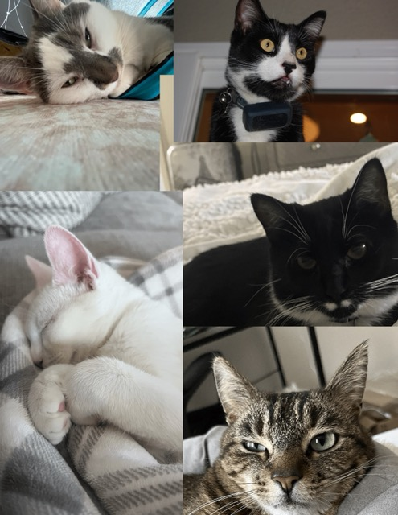

---
#http://docs.csartisan.org/docs/contributing/

title: "Purrs and Paws for the Applause"
author: "Delight Kim"
categories: [ misc ]
image: ./assets/images/posts/none/5.jpg
imagecred: ""
tags: []
---
Cats have been the pinnacle of animal worship since Ancient Egypt, and they act like they know it! Whether they are the spawn of gods or couch potatoes, felines love respect, laser beams, and catnip. Today is “National Respect Your Cat Day.”  This feline-loving CSArtisan Journalist spoke with four other cat owners on how they honor their cat, and what they’d say to them if they could understand.	

“Morris is an 11 year old American Shorthair. He isn’t all that smart, but is such an extroverted, gentle cat. He’s also very, very, big. He’s very picky about his food and environment and requires a certain brand of pretty much everything, so we respect that to the best of our ability. Not to be corny, but I'd tell him that we love him very much.” said Jane Kistner,  freshman, Creative Writing conservatory. 

“My cat’s name is Ollie. He’s a tuxedo cat and is 2.5 years old. He is super friendly and is active. I show love and respect to my cat by taking photos of him and playing with him, and giving him lots of attention. I would like to say to my cat thank you for peeing in the sink and pooping outside so I don’t have to clean up after him,” said Lula Seifert, freshman, Integrated Arts conservatory. 

“Burger is a white Khao Manee and Paris is a Black Tuxedo. Burger is only 8 months old and Paris is 3 years old. Burger is very social and friendly.  He loves to go outside and play with the neighbors, while Paris is calmer and more introverted. I show my cats that I love them by playing with them and cuddling them and secretly giving them treats without my mother knowing to make them happy. My cats are the sweetest cats ever and I am so incredibly thankful to have them a part of my life every day,”said  Lyna Chataignoux, freshman,  Musical Theater Conservatory. 

“My cat is named Hannah. She's 8 years old and she hates being pet. She only wants love through food, so to her, I only show respect 3 times a day. If I could talk to my cat I would tell her to shower.” Ari Dawson, freshman, Creative Writing conservatory.

I used to have a cat as well- a gorgeous white and gray Persian longhair. His name was Roko, and he passed away a few months ago at the impressive age of nineteen! He was cautious around strangers, but gentle to my family. As a baby, I attempted to crawl over him and often pulled at his hair, but he never lashed out. He came by our side when wanted to be petted, and cried when we closed bedroom doors. I loved him dearly still, and if I could, I would tell him that I love and miss him so much. My family and I pay our respects to him with a small altar near our stairs, and go through photos of him. Even though he’s not with us anymore, he was one of the biggest parts of my childhood, and I’m sure that whatever afterlife he is in, he stares down at me strangely when I make bad decisions. 

According to the American Veterinary Association, a third of American households have cats as pets.  That makes almost 74 million domesticated cats!  This shows cats are important beings that continue to grace us with their presence on Earth! 

